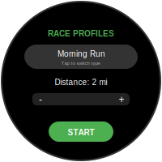
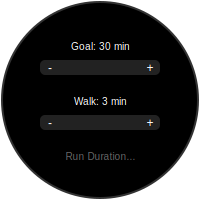
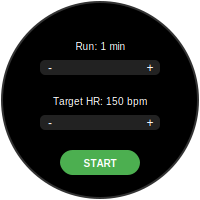
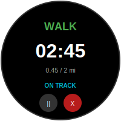

# RunApp - 5K Race Tracker (Pixel 4 Optimized)

RunApp is a cross-platform application built with **Compose Multiplatform**. It helps runners and walkers track their progress during a race using an alternating Walk/Run strategy.

## 🚀 Native Wear OS Experience
<p align="center">
  
  
  
  
</p>

This version is specifically optimized for the **Pixel 4 Watch**.
 It uses native `androidx.wear.compose` components for a circular screen, including:
- **ScalingLazyColumn**: For smooth, curved scrolling.
- **InlineSliders**: Precise adjustment of race parameters.
- **TimeText**: Native system clock integration.

## 🛠 Tech Stack
- **Kotlin Multiplatform (KMP)**: Shared business logic and state.
- **Compose Multiplatform (CMP)**: Shared UI logic.
- **Wear OS Compose**: Native Android Watch UI.
- **Gradle 9.3.1 / Java 21**: Optimized build environment.

---

## 📖 User Guide

### 1. Configuring Your Race
The app now supports **Three Persistent Profiles** for different training goals:
- **Morning Run**: Optimized for quick daily sessions (Default 2.0 mi).
- **5K Goal**: Specifically tuned for 5K race prep (Default 3.1 mi).
- **Training**: For longer endurance sessions (Default 5.0 mi).

#### **Settings Fields:**
- **Race Profile**: Tap the top chip to cycle through preset names and base settings.
- **Distance (mi)**: Target race distance (Adjustable 1-10 mi).
- **Goal Time (min)**: Your target total time for the race (Adjustable 5-60 min).
- **Walk Duration (min)**: How long each walking interval lasts.
- **Run Duration (min)**: How long each running interval lasts.
- **HR Walk (bpm)**: Maximum desired heart rate during walk intervals.
- **HR Run (bpm)**: Maximum desired heart rate during run intervals.

**How it works:**
- **Auto-Save**: Any changes made to these sliders are saved instantly to the active profile.

### 2. During the Race
Tap **START** to begin. The watch will:
- **Display Mode**: Clearly show "WALK" (Green) or "RUN" (Red).
- **Countdown**: Show the time remaining in the current sequence.
- **Progress**: Show your total distance covered vs. your goal.
- **Coaching**: Display "ON TRACK", "TOO SLOW", or "TOO FAST" based on your goal time.
- **HR Alert Overlay**: A high-visibility red overlay appears if your heart rate exceeds the target for your current activity (Walk or Run). It displays your exact BPM and requires you to tap "OK" to dismiss it, ensuring your safety.

### 3. Controls
- **Pause/Resume (►/||)**: Pause the race if you need to stop.
- **Cancel (X)**: End the race immediately and return to settings.
- **Auto-Finish**: The app will display "DONE!" automatically once your target distance is reached.

---

## 📱 Installation (For Developers)

### 1. Watch Preparation
1.  **Developer Mode**: *Settings > System > About > Versions*. Tap "Build Number" 7 times.
2.  **Wireless Debugging**: Enable in *Settings > Developer Options*. Turn **Bluetooth OFF** for stability.

### 2. Build & Install
```bash
export JAVA_HOME=/Library/Java/JavaVirtualMachines/zulu-21.jdk/Contents/Home
./gradlew clean :composeApp:installDebug --no-daemon
```

---

## 🔮 Upcoming UX Iterations (Planned)
- **Haptic Feedback**: Vibration alerts when switching between Walk and Run.
- **Audio Cues**: Voice "WALK" or "RUN" commands through paired earbuds.
- **Live Sensors**: Integration with real GPS and Heart Rate hardware (currently using stable bridge).
- **Race History**: Saving and viewing past race stats by name.

## 🔧 Troubleshooting Fixed
- **Java 25 Compatibility**: Pinned build to Java 21.
- **ADB Handshake**: Implemented `adb pair` protocol for Wear OS 4+.
- **Circular Clipping**: Implemented `ScalingLazyColumn` for native watch fit.
